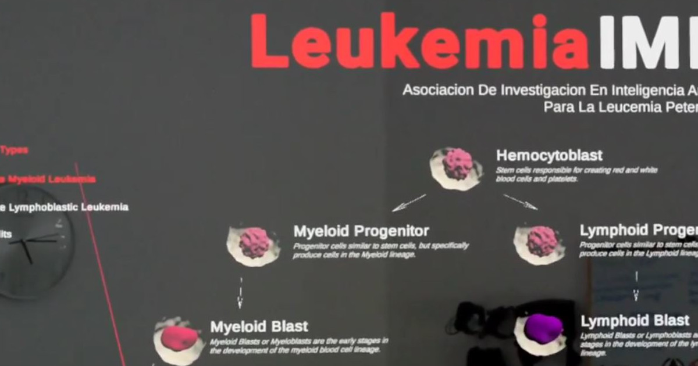

# Asociación de Investigacion en Inteligencia Artificial Para la Leucemia Peter Moss
## Leukemia In Mixed Reality (LeukemiaIMR)

     

&nbsp;

# Table Of Contents

- [Introduction](#introduction)
- [Motivation](#motivation)
- [Leukemia](#leukemia)
- [Magic Leap](#magic-leap)
- [GETTING STARTED](#getting-started)
- [Contributors](#contributors)
- [Credits](#credits)
- [License](#license)
- [Bugs/Issues](#bugs-issues)

&nbsp;

# Introduction

[Leukemia In Mixed Reality](https://www.leukemiaairesearch.com/research/project/leukemia-ai-research/leukemia-in-mixed-reality) is a free information application for [Magic Leap 1]() providing information in Mixed Reality about Leukemia, Hemopoiesis, Acute Myeloid & Lymphoblastic Leukemia.

The project is part of our [Open Information Initiative](https://www.leukemiaairesearch.com/research/open-information) initiative, designed to share open information related to Leukemia, other blood/bone marrow cancers & COVID-19.

&nbsp;

# Motivation

The motivation behind LeukemiaIMR was to create an application providing open information about Leukemia in Mixed Reality. Our [Open Information Initiative](https://www.leukemiaairesearch.com/research/open-information) is an important part of our Association, with the goals of disseminating free information about Leukemia, spreading awareness and understanding about the disease.

&nbsp;

# Leukemia

[Leukemia](https://www.leukemiaairesearch.com/research/leukemia) is a blood cancer characterized by a rapid production of abnormal white blood cells called blasts. These malignant cells may be found in the bone marrow, where the blood cells are generated, and in the peripheral blood (i.e. in circulation within the blood vessels). As the disease progresses, the leukemic white blood cells swamp out the healthy blood cells, preventing them to perform their functions, like fighting infections or avoiding serious bleeding.

In 2020, almost 500,000 new patients were diagnosed with leukemia all over the world and approximately 312,000 individuals died with this disease. In the United States, there are over 60,000 new cases every year, and over 24,000 patients die from leukemia annually.

Like other cancers, there are many kinds of leukemia. The most common leukemias are four types, classified as chronic or acute, and myeloid or lymphoblastic (lymphocytic). Chronic leukemias tend to develop over several years whereas acute leukemias are more aggressive and develop over months. Myeloid or lymphoblastic leukemia refer to the specific types of white blood cells involved in the leukemia.

Find out more about the different types of Leukemia on our [website](https://www.leukemiaairesearch.com/research/leukemia).

&nbsp;

# Magic Leap

This project uses the revolutionary Magic Leap 1 and Magic Leap's Spatial Computing Environment. Magic Leap 1 is a lightweight headset that uses Spatial Computing to map out rooms allowing applications to understand their enviroment and to interact accordingly.

To develop applications for Magic Leap 1 we use the Magic Leap Lab which allows us to use Lumin SDK, Lumin Runtime editor, and SDK packages for Unity Software and Unreal Editor.

&nbsp;

# GETTING STARTED

Coming soon!

&nbsp;

# Contributors

- [Adam Milton-Barker](https://www.leukemiaairesearch.com/association/volunteers/adam-milton-barker "Adam Milton-Barker") - [Asociación de Investigacion en Inteligencia Artificial Para la Leucemia Peter Moss](https://www.leukemiaresearchassociation.ai "Asociación de Investigacion en Inteligencia Artificial Para la Leucemia Peter Moss") President/Founder & Lead Developer, Sabadell, Spain
- [Dr Rita Rb-Silva](https://www.leukemiaairesearch.com/association/volunteers/rita-silva-md-phd "Dr Rita Rb-Silva") - [Asociación de Investigacion en Inteligencia Artificial Para la Leucemia Peter Moss](https://www.leukemiaresearchassociation.ai "Asociación de Investigacion en Inteligencia Artificial Para la Leucemia Peter Moss") Medical Advisor (Hematology), Porto, Portugal

&nbsp;

# Credits

- Designed & Developed by [Adam Milton-Barker](https://www.leukemiaairesearch.com/association/volunteers/adam-milton-barker "Adam Milton-Barker"), [Asociación de Investigacion en Inteligencia Artificial Para la Leucemia Peter Moss](https://www.leukemiaresearchassociation.ai "Asociación de Investigacion en Inteligencia Artificial Para la Leucemia Peter Moss") President/Founder & Lead Developer.

- Medical information review [Dr Rita Rb-Silva](https://www.leukemiaairesearch.com/association/volunteers/rita-silva-md-phd "Dr Rita Rb-Silva"), [Asociación de Investigacion en Inteligencia Artificial Para la Leucemia Peter Moss](https://www.leukemiaresearchassociation.ai "Asociación de Investigacion en Inteligencia Artificial Para la Leucemia Peter Moss") Medical Advisor (Hematology).

- Research Source: [Automatic Recognition of Acute Myelogenous Leukemia in Blood Microscopic Images Using K-means Clustering and Support Vector Machine](https://pubmed.ncbi.nlm.nih.gov/27563575/) Esmaeili M, Dehnavi AM, Rabbani H, Hajizadeh F. Automatic Recognition of Acute Myelogenous Leukemia in Blood Microscopic Images Using K-means Clustering and Support Vector Machine. J Med Sign Sence 2016;6:183-193.

- Human [Femur 3D Model](https://sketchfab.com/3d-models/human-femur-a9c1f1a88b104c3fbfe975fa10b31b31): Eric Bauer.

- Thank you to [Magic Leap](https://www.magicleap.com/en-us) for sponsoring the hardware to make our mixed reality applications possible.

&nbsp;

# License
This project is licensed under the **MIT License** - see the [LICENSE](LICENSE "LICENSE") file for details.

&nbsp;

# Bugs/Issues
We use the [repo issues](issues "repo issues") to track bugs and general requests related to using this project. See [CONTRIBUTING](CONTRIBUTING.md "CONTRIBUTING") for more info on how to submit bugs, feature requests and proposals.